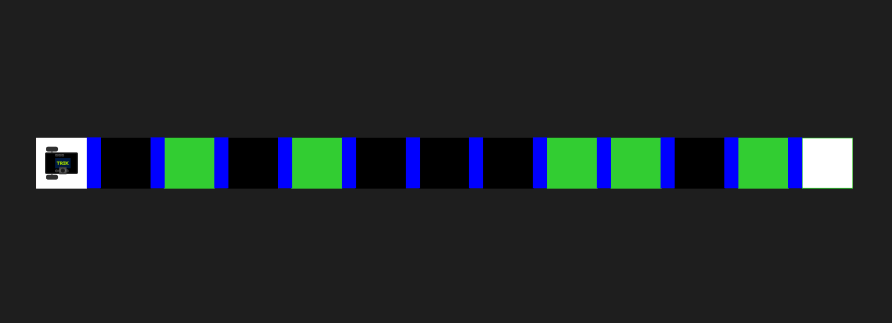

# Проезд по квадратам

## Дано

- Поле, представляющие из себя вытянутый по горизонтали прямоугольник,
разделенный на квадратные секции черного, белого и зеленого цветов. Секции
в свою очередь разделены вытянутыми по вертикали синими прямоугольниками.
- Первая и последняя секции гарантированно имеют белый цвет заливки. 
Среди остальных секций гаратнтированно есть с зеленой и черной заливкой.
- Робот, находящийся посередине самой левой секции поля, направленный вправо,
параллельно длиной стороне поля. Также у робота имеется датчик освещенности A1.

## Требуется

Проехать из стартовой белой секции в финишную белую, остановившись в максимальном количестве
зеленых секций. За каждую остановку в зеленой секции начисляются баллы. Максимальное количество
баллов можно набрать при остановке во всех секциях. За остановку вне стартовой, финишной или зеленой секций
баллы аннулируются и задание считается проваленным.

